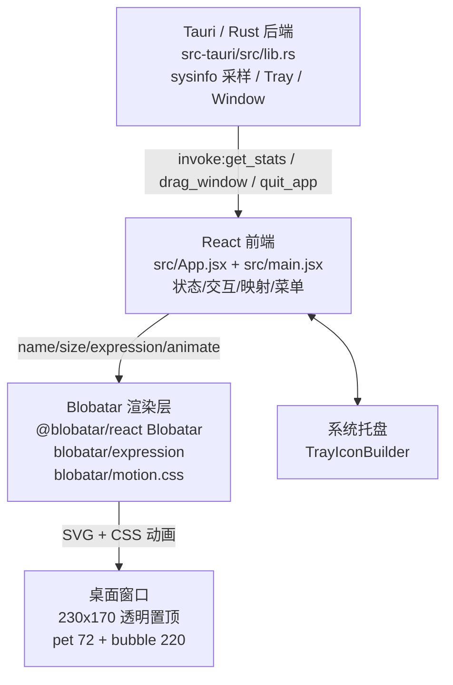

# WinPet x Blobatar

> 基于 **Tauri + React** 的 Windows 桌面宠物 / 系统状态助手。`Blobatar` 仅负责角色的**视觉、表情与动画**层；系统监控、窗口与托盘能力由 Rust/Tauri 后端与 React 前端实现。


*WinPet 实际运行效果（185×130 透明置顶窗口：状态气泡 + Blobatar 宠物）*

---

## 这是什么

WinPet 是一个常驻桌面的透明小宠物窗口，实时把 **CPU / 内存 / 磁盘 / 网络** 的运行状态“翻译”成 Blobatar 的表情与状态气泡。关闭窗口不会退出程序，而是**隐藏到系统托盘**，点托盘可随时唤回。

目前处于可本地开发/构建的可用状态，**未发布为独立安装包之外的生态产品**，Windows 下可直接 `npm + Tauri` 开发。

---

## 主要能力（以当前代码为准）

- **桌面宠物本体**：`Blobatar` 头像，固定 `size={72}`，由 `name` 字符串确定性生成几何形象（改名即换脸）
- **14 种表情自动切换**（来自 `blobatar/expression`）：`idle / happy / sad / mad / surprised / scared / sick / sleepy / thinking / wink / smug / love / shy / unsure` — 当前自动映射（`src/App.jsx: stateFromStats`）：
  - `disk < 10%` → `scared`；`cpu > 75%` → `mad`；`mem > 85%` → `sad`；`net > 200KB/s` → `surprised`；否则 `idle`
- **状态气泡**：透明气泡 `pre` 文本显示 `CPU %   MEM % / NET K/M/s   DISK %`（`formatStats`），可通过右键菜单显隐
- **系统监控**：Rust 层 `sysinfo` 每秒采样（`src-tauri/src/lib.rs: Monitor::sample`）`global_cpu_usage / used_memory / available_space(取多盘最小) / networks rx+tx`，通过 Tauri `invoke("get_stats")` 供给前端；浏览器预览无 Tauri 时自动走 mock 随机游走
- **窗口行为**：`src-tauri/tauri.conf.json: width 230 x height 170`（最小 200x150）、`transparent:true / decorations:false / alwaysOnTop:true / skipTaskbar:true`、阴影为 CSS 模拟；支持**拖动**（Tauri `start_dragging`，浏览器降级为 `pointermove + translate`）
- **交互**：
  - 双击角色 → 改名输入框（`maxLength 24`）
  - 右键 → 菜单：`改名 / 隐藏状态|显示状态 / 隐藏到后台 / 退出（danger）`
  - 托盘：图标 `WinPet`、`显示宠物 / 退出` 菜单，左键点击托盘唤起窗口；`CloseRequested` 拦截为 `hide()`，仅托盘“退出”/`quit_app` 真正退出
- **其他**：`Maple Mono NF CN` 字体（`src/assets/fonts`）、`pet-shadow` 柔化、重命名/菜单的点击外部自动关闭

> 以上均可在 `src/App.jsx` 与 `src-tauri/src/lib.rs` 直接核对，未引入未写的功能。

---

## 架构

### 分层图（Mermaid）



### 文字版（无 Mermaid 环境可看）

```
[ Rust / Tauri ]  --get_stats/drag_window/quit_app-->  [ React 前端 ]
      |  托盘/窗口生命周期/系统采样                         |  useStats / stateFromStats / 菜单/拖动/改名
      v                                                    v
                                            [ Blobatar ]
                                     Blobatar 组件 + 14 expression + motion.css
                                                     |
                                                     v
                                               [ 透明桌面窗口 ]
```

- **后端只做系统与桌面能力**，不画角色
- **前端只做业务与交互**，不直接采样系统
- **Blobatar 只做渲染与表情**，不参与任何系统监控/托盘逻辑

---

## Blobatar 在本项目中的作用

**实际 import（`src/App.jsx:2,3,6`）：**
```ts
import { Blobatar } from "@blobatar/react";
import "blobatar/motion.css";
import { idle, happy, sad, mad, surprised, scared, sick, sleepy, thinking, wink, smug, love, shy, unsure } from "blobatar/expression";
```
- `@blobatar/react` 的 `Blobatar`：`name={name} size={72} expression={activeExpr} animate="always"`（`src/App.jsx:152`）
- `blobatar/expression` 的 **14 个常量**：如上；运行时通过 `EXPRESSIONS[autoExpr] ?? idle` 选择
- `blobatar/motion.css`：表情切换动画（`sideEffects` 保留避免被打包器 tree-shake）

**不是 Blobatar 做的事**：系统 CPU/内存/磁盘/网络采样、托盘、窗口拖动/置顶/透明、改名/菜单等，全部由本项目（React + Tauri/Rust）实现。

---

## 依赖关系 / 引用来源

- `blobatar@2.2.0`、`@blobatar/react@2.2.0` — 同一上游 monorepo **`github.com/Alain00/blobatar`**（`blobatar` 目录 `packages/blobatar`，`@blobatar/react` 目录 `packages/react`）
- 锁定依据：`package.json` `^2.2.0` + `package-lock.json` `resolved: https://registry.npmjs.org/...2.2.0.tgz` + `node_modules/*/package.json: 2.2.0` 四处一致
- **引用方式**：`npm install` 的**依赖调用**，仓库内无 Blobatar 源码拷贝，也未修改上游源码（仅 `import`）

---

## 技术栈

- **后端**：`Tauri 2.11` / `Rust` / `sysinfo`（系统采样）、`tauri_plugin_log`
- **前端**：`React 19.2.8` / `React-DOM 19.2.8` / `Vite 8.2` / `@vitejs/plugin-react 6.0.4` / `@tauri-apps/api 2.11.1`
- **角色视觉**：`blobatar 2.2.0` / `@blobatar/react 2.2.0`
- **工具**：`oxlint 1.75` / `@tauri-apps/cli 2.11.4` / `@types/react*`

---

## 目录结构

```
winpet-blobatar/
├─ src/                 # React 前端
│  ├─ App.jsx           # 宠物主组件：状态/表情映射/拖动/菜单/改名
│  ├─ main.jsx          # 入口，StrictMode + createRoot
│  ├─ App.css / index.css
│  └─ assets/           # MapleMono 字体、hero/react/vite 资源
├─ src-tauri/           # Tauri / Rust 后端
│  ├─ src/lib.rs        # Monitor 采样 + get_stats/drag_window/quit_app + 托盘/窗口事件
│  ├─ src/main.rs       # #![windows_subsystem] + app_lib::run()
│  ├─ tauri.conf.json   # 窗口 230x170 透明置顶、bundle nsis、icons
│  ├─ Cargo.toml / Cargo.lock
│  └─ icons/
├─ public/              # favicon.svg / icons.svg
├─ index.html / vite.config.js / .oxlintrc.json
├─ package.json         # scripts: dev/build/tauri/tauri:dev/tauri:build
└─ .github/workflows/build-windows.yml
```

---

## 下载 / Releases

最新稳定版请见 [GitHub Releases](https://github.com/qq824045252-ship-it/winpet-blobatar/releases)（或本仓库右侧 Releases 面板）。

- **Portable 单文件 EXE（免安装）**：`WinPet-v0.1.0-portable-x64.exe` — 下载后双击直接运行，适合尝鲜/便携使用。
- **安装程序**：`WinPet_0.1.0_x64-setup.exe`（NSIS）— 向导安装，适合长期使用；安装后可在开始菜单/桌面找到 WinPet。

> 两个产物均由本仓库 `v0.1.0` Tag 通过 `npm run tauri:build` 构建，Release 备注中附 SHA256 校验值。具体下载链接请以 Releases 页面为准，勿使用固定直链硬编码。

---

## 安装 / 开发 / 构建（Windows 新手可直接复制）

> 要求：`Node.js >= 20`、`Rust stable`（`rustup` 安装）、`WebView2`（Win11 自带）

```powershell
# 1) 克隆
git clone https://github.com/qq824045252-ship-it/winpet-blobatar.git
cd winpet-blobatar

# 2) 安装前端依赖
npm ci              # 或 npm install；首次建议 ci 保持与 package-lock.json 一致

# 3) 仅前端预览（浏览器 mock 数据，无系统采样）
npm run dev         # http://localhost:5179

# 4) 完整桌面宠物（Tauri + 系统采样）
npm run tauri:dev   # 等价 npm run tauri dev

# 5) 只打包前端
npm run build       # 产物 dist/

# 6) 打包 Windows 安装包（NSIS）
npm run tauri:build # 产物 src-tauri/target/release/bundle/
```

`package.json: scripts` 原文：`dev: vite`、`build: vite build`、`lint: oxlint`、`preview: vite preview`、`tauri: tauri`、`tauri:dev: tauri dev`、`tauri:build: tauri build`

---

## 第三方授权

- **Blobatar / @blobatar/react 均为 MIT License**（作者 `Alain`，`Copyright (c) 2026 Alain`），详见 **[THIRD_PARTY_NOTICES.md](./THIRD_PARTY_NOTICES.md)**。
- **WinPet 主项目**采用 **MIT License**（见 [`LICENSE`](./LICENSE)，`Copyright (c) 2026 qq824045252-ship-it`）。第三方组件仍分别受其自身许可约束。

---

## 上游致谢 / Attribution

角色生成与表情体系来自 **[Alain00/blobatar](https://github.com/Alain00/blobatar)**。感谢上游以 MIT 协议开放高质量的确定性几何头像实现。

---

## 许可说明

- 本项目：**MIT License**，见 [`LICENSE`](./LICENSE)
- 第三方：见 [`THIRD_PARTY_NOTICES.md`](./THIRD_PARTY_NOTICES.md)（Blobatar MIT）
