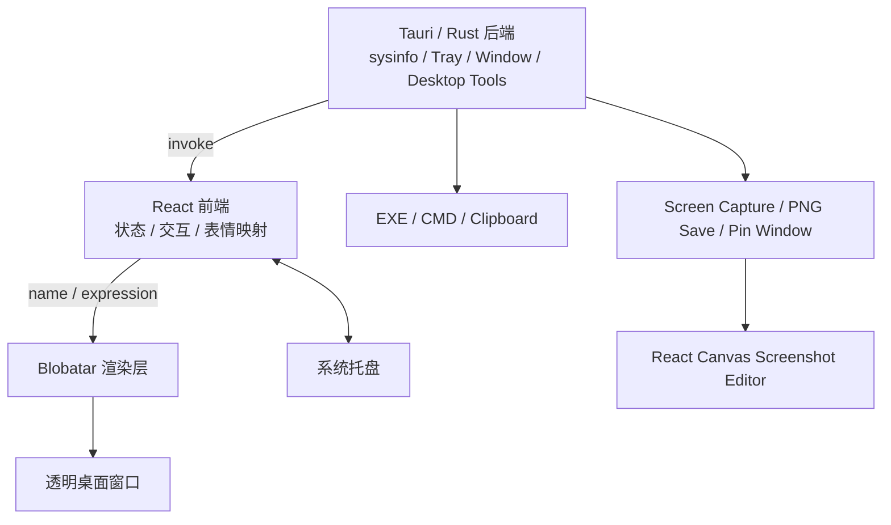

# WinPet 🖥️🐱

> 一个会根据 CPU / 内存 / 磁盘 / 网络状态自动变表情的 Windows 桌面宠物

基于 **Tauri + React + Blobatar** 实现，轻量、透明置顶、托盘常驻。

[](LICENSE)
[](https://github.com/qq824045252-ship-it/winpet-blobatar/releases)
[](https://tauri.app)
[](https://react.dev)


*WinPet 实际运行效果（透明置顶窗口：状态气泡 + Blobatar 宠物）*

**[⬇️ 立即下载最新版](https://github.com/qq824045252-ship-it/winpet-blobatar/releases)**

---

## ✨ 功能亮点

- 🐱 **会变表情的桌面宠物**：根据系统负载自动切换 14 种表情
- 📊 **实时系统监控**：CPU / 内存 / 磁盘 / 网络状态一目了然
- 🖱️ **轻量交互**：支持拖动、双击改名、右键菜单、托盘常驻
- 🚀 **快捷启动**：可保存一个 EXE 路径，也可保存并运行 CMD 命令或 `.cmd/.bat` 脚本
- 📋 **文本剪贴板历史**：自动记录最近 50 条纯文本，点击任意历史项即可重新复制
- 📸 **区域截图与标注**：框选任意区域，支持画笔、矩形、椭圆、箭头、文字、撤销和重选
- 📌 **无边框钉图**：截图可直接保存并钉在桌面最前方，拖动移动、右键关闭
- 🪟 **透明置顶窗口**：不挡视线，随时可用
- 📦 **双模式发布**：Portable 免安装版 + 正式安装包

### 表情自动映射规则

| 条件 | 表情 |
|------|------|
| 磁盘剩余 < 10% | `scared` |
| CPU > 75% | `mad` |
| 内存 > 85% | `sad` |
| 网络 > 200KB/s | `surprised` |
| 其他情况 | `idle` |

支持的表情：`idle / happy / sad / mad / surprised / scared / sick / sleepy / thinking / wink / smug / love / shy / unsure`

---

## 🧰 桌面工具

右键宠物即可打开工具入口：

- **启动程序 / CMD**：填写 EXE 完整路径即可启动；CMD 输入支持普通命令，也支持 `.cmd/.bat` 文件路径。配置会保存在本机，下次启动继续使用。
- **文本剪贴板**：自动监听 Windows 剪贴板变化，仅当内容是纯文本时加入历史；最多保留 50 条，重复内容自动去重，点击任意一条即可重新复制。图片、文件和 HTML 不会进入历史。
- **截图与标注**：WinPet 会先隐藏宠物自身，再抓取 Windows 虚拟桌面作为底图；拖动选择区域后进入标注模式，可使用画笔、矩形、椭圆、箭头和文字，支持撤销与重新框选。
- **保存 / 保存并钉住**：确认后立即生成 PNG 文件并返回本机路径，默认保存到系统“图片/WinPet”目录；选择“保存并钉住”会同时创建独立的无边框、始终置顶截图窗口。
- **钉图交互**：按住钉图可拖动位置，右键即可关闭；钉图窗口不占任务栏。

> EXE/CMD 能力只会执行你主动填写的本机路径或命令。开源版本不会内置、下载或静默执行任何外部程序。剪贴板历史仅保存在本机。截图 WebView 只允许读取 WinPet 自己的临时截图目录和最终截图目录。

---

## 📥 下载与使用

最新稳定版请前往 **[Releases](https://github.com/qq824045252-ship-it/winpet-blobatar/releases)** 下载：

| 版本 | 说明 | 适用场景 |
|------|------|----------|
| **Portable EXE** | `WinPet-v0.1.0-portable-x64.exe` | 免安装，双击即用，适合尝鲜 |
| **安装程序** | `WinPet_0.1.0_x64-setup.exe`（NSIS） | 正式安装，开始菜单/桌面快捷方式 |

> Release 备注中附有 SHA256 校验值，请以 Releases 页面实际文件为准。

---

## 🛠️ 开发与构建

### 环境要求

- Node.js ≥ 20
- Rust stable（通过 `rustup` 安装）
- WebView2（Windows 11 自带，Windows 10 需安装）
- Windows PowerShell 5.1+（剪贴板与屏幕底图抓取使用系统 PowerShell 能力）

### 快速开始

```powershell
# 1. 克隆仓库
git clone https://github.com/qq824045252-ship-it/winpet-blobatar.git
cd winpet-blobatar

# 2. 安装依赖
npm ci

# 3. 仅前端预览（浏览器 mock 数据）
npm run dev          # http://localhost:5179

# 4. 完整桌面宠物（含系统采样与桌面工具）
npm run tauri:dev

# 5. 打包 Windows 安装包
npm run tauri:build  # 产物在 src-tauri/target/release/bundle/
```

GitHub Actions 的 `Build Windows` 工作流只支持手动 `workflow_dispatch`，普通 push 不会自动消耗云端构建额度。

---

## 🏗️ 架构说明



- **后端**（Rust / Tauri）：负责系统采样、窗口与托盘，以及 EXE/CMD、纯文本剪贴板、屏幕底图抓取、PNG 落盘和钉图窗口
- **前端**（React）：负责业务逻辑、交互、文本剪贴板历史、截图区域选择和 Canvas 标注
- **Blobatar**：只负责视觉与动画渲染

### 核心文件

| 路径 | 职责 |
|------|------|
| `src/App.jsx` | 主组件：状态管理、表情映射、拖动、菜单、工具入口与截图模式切换 |
| `src/ScreenshotEditor.jsx` | 区域框选、画笔/规则图形/文字标注、保存、钉图视图 |
| `src/ScreenshotEditor.css` | 截图编辑器与无边框钉图样式 |
| `src-tauri/src/lib.rs` | 系统监控、托盘/窗口事件、EXE/CMD、剪贴板、截图落盘与钉图窗口 |
| `src-tauri/tauri.conf.json` | 主窗口和截图 asset protocol 安全范围 |

---

## 📦 技术栈

| 层级 | 技术 |
|------|------|
| 后端 | Tauri 2.11 / Rust / sysinfo / Windows PowerShell |
| 前端 | React 19 / Vite 8 / Canvas / @tauri-apps/api |
| 角色视觉 | blobatar 2.2.0 / @blobatar/react 2.2.0 |
| 工具 | oxlint / @tauri-apps/cli |

---

## 📂 目录结构

```
winpet-blobatar/
├─ src/                 # React 前端
│  ├─ App.jsx           # 主组件
│  ├─ ScreenshotEditor.jsx
│  ├─ ScreenshotEditor.css
│  ├─ main.jsx
│  └─ assets/
├─ src-tauri/           # Tauri / Rust 后端
│  ├─ src/lib.rs
│  ├─ tauri.conf.json
│  └─ icons/
├─ public/
├─ package.json
└─ .github/workflows/
```

---

## 🙏 致谢

角色生成与表情体系来自 **[Alain00/blobatar](https://github.com/Alain00/blobatar)**（MIT License）。感谢上游开放高质量的确定性几何头像实现。

本项目通过 npm 依赖方式引用 `blobatar@2.2.0` 与 `@blobatar/react@2.2.0`，未修改上游源码。

截图功能借鉴常见 Snip & Pin 产品交互思路，相关区域选择、标注、保存与钉图代码均为 WinPet 自有实现，没有复制 GPL 项目源码。

---

## 📄 License

- 本项目：**MIT License**（见 [LICENSE](./LICENSE)）
- 第三方组件：见 [THIRD_PARTY_NOTICES.md](./THIRD_PARTY_NOTICES.md)
